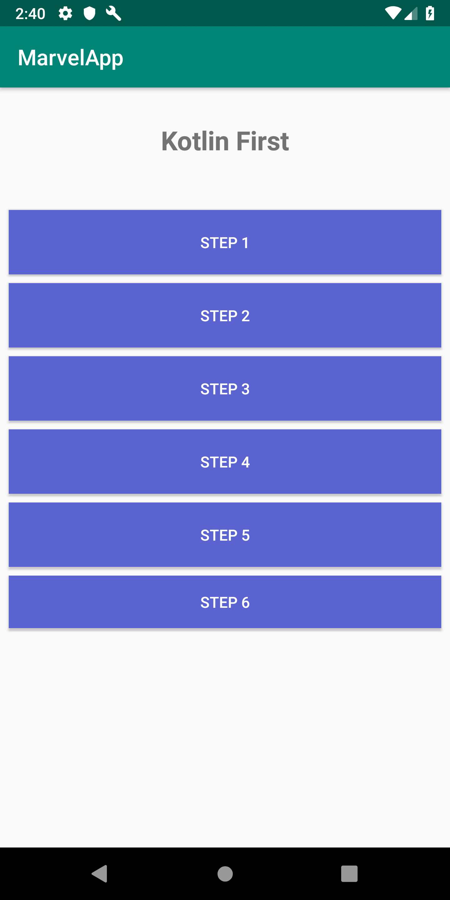
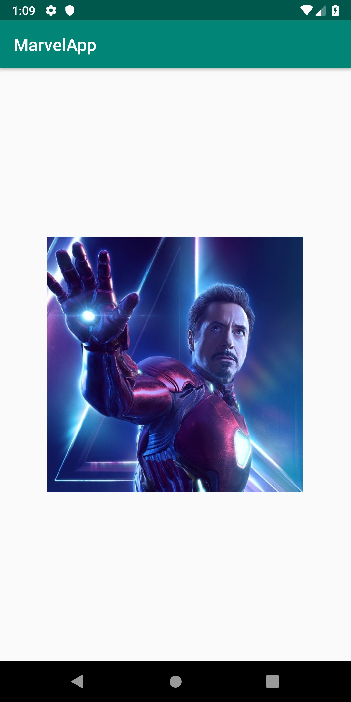
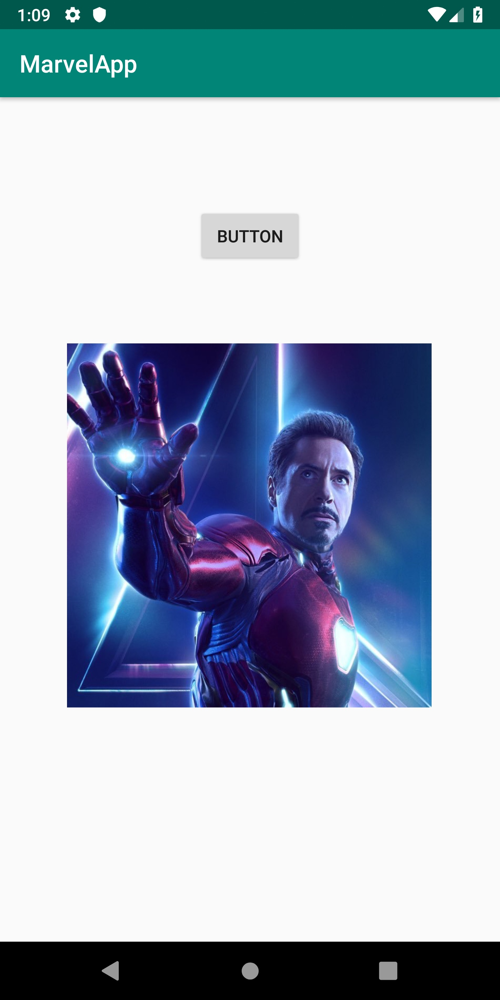
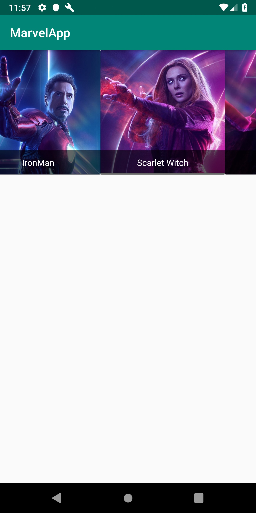
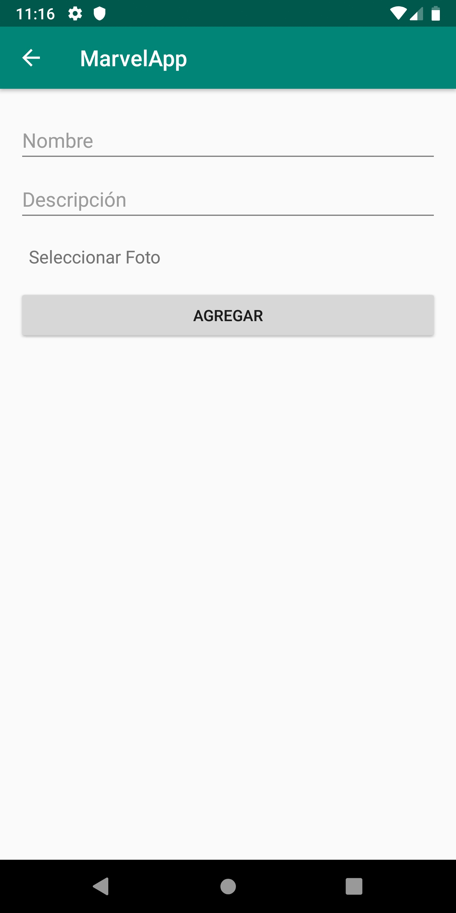
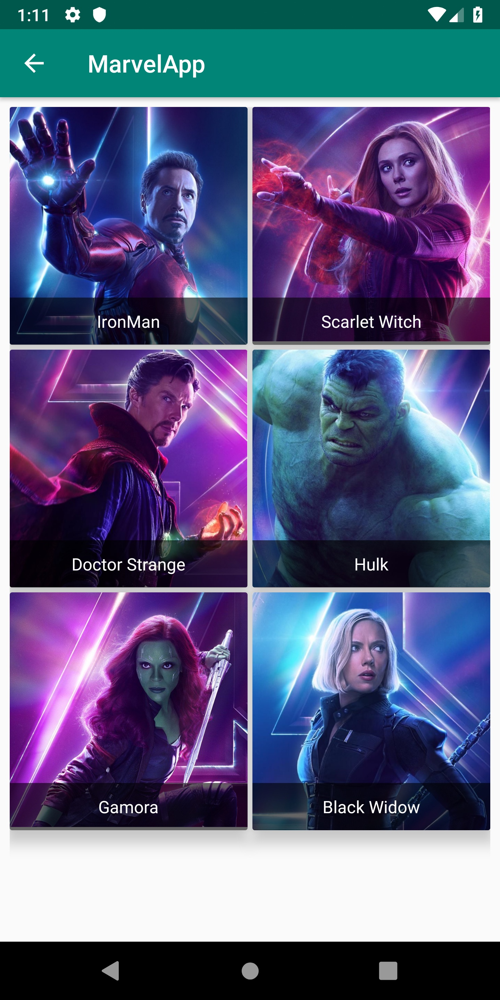
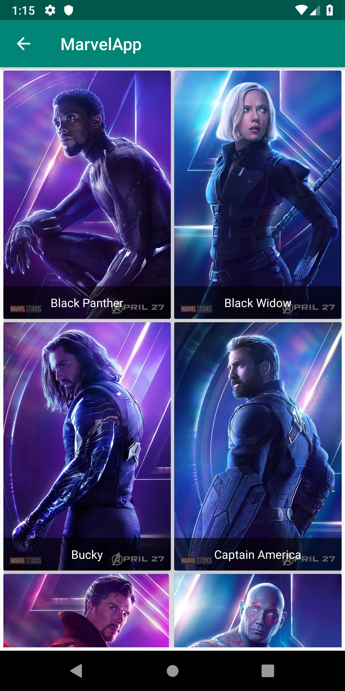

# kotlin-first
Codelab Kotlin - GDG Lima IO Extended Lima 2019

## Step 1

## Step 2

## Step 3

## step 4

## Step 5

## Step 6

# References

Página oficial https://kotlinlang.org/

Documentación https://kotlinlang.org/docs/reference/

Compilador online https://play.kotlinlang.org/

Android Codelabs https://codelabs.developers.google.com/?cat=Android 

Github repositories https://github.com/search?q=language:Kotlin

Training :
- Kotlin for Android Developers https://es.coursera.org/learn/kotlin-for-java-developers
- Kotlin for Android Developers  https://www.udacity.com/course/kotlin-for-android-developers
- Kotlin Bootcamp for Programmers https://www.udacity.com/course/kotlin-bootcamp-for-programmers
- Developing Android App with Kotlin https://www.udacity.com/course/developing-android-apps-with-kotlin

Communities :
- Kotlin Perú
- Kotlin for Android Developers [antonioleiva.com]
