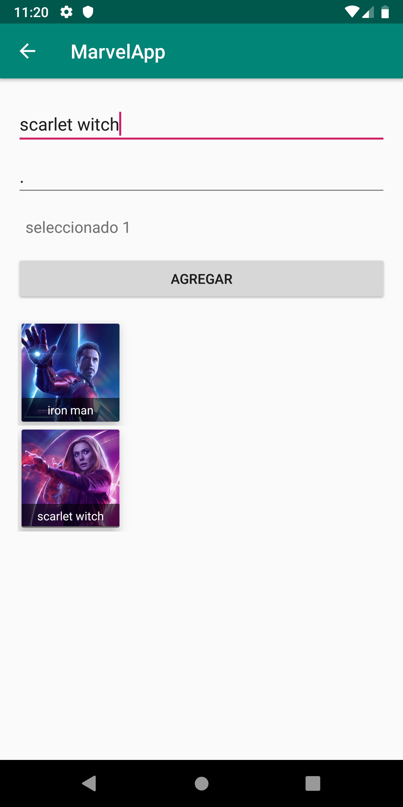

# kotlin-first
Codelab Kotlin - GDG Lima IO Extended Lima 2019

Slide : https://docs.google.com/presentation/d/1ASbryoETUm3Hgz4BERL45gzpOAdl_YdwVn0PIRgyV8E/edit?usp=sharing

Sample: https://github.com/emedinaa/kotlin-first/archive/master.zip


## Requerimientos 

- Android Studio 3.3.2 o superior https://developer.android.com/studio

- Conocimientos básicos de Android https://developer.android.com/ 

- Kotlin documentación oficial https://kotlinlang.org/docs/reference/

## Step 1 /2
En esta sección vamos crear un nuevo proyecto usando Android Studio con Kotlin y revisaremos los conceptos básicos del lenguaje Kotlin. Por ejemplo, tipos de Datos, funciones , null safety

```kotlin
private val hero:String= "Iron Man"
    private var message="He privatizado exitosamente la paz mundial!"
    private var desc:String?=null
    private val gender:Int =1
    private var photo:Int =0

    override fun onCreate(savedInstanceState: Bundle?) {
        super.onCreate(savedInstanceState)
        setContentView(R.layout.activity_step1)
        //supportActionBar?.setDisplayHomeAsUpEnabled(true)

        desc= "También conocido en español como el Hombre de Hierro — es un superhéroe ficticio que aparece en los cómics estadounidenses publicados por Marvel Comics. "
        imageView.setOnClickListener {
            showMessage()
        }
    }

    private fun showMessage(){

        val nMessage= hero.plus(" ").plus(message)
        Toast.makeText(this,nMessage,Toast.LENGTH_LONG).show()
    }

    /*override fun onSupportNavigateUp(): Boolean {
        onBackPressed()
        return true
    }*/
```

## Step 3
En esta sección veremos sobre Collections, List, MutableLists y Adapters.

```kotlin
 //private var heroList:MutableList<HeroEntity>?=null
    private var heroList:MutableList<HeroEntity> = mutableListOf()

    override fun onCreate(savedInstanceState: Bundle?) {
        super.onCreate(savedInstanceState)
        setContentView(R.layout.activity_step3)
        supportActionBar?.setDisplayHomeAsUpEnabled(true)

        val layoutManager= LinearLayoutManager(this,LinearLayoutManager.HORIZONTAL,false)
        recyclerView.layoutManager= layoutManager

        //load Data
        //loadDataWithList()
        loadDataWithMutableList()

        //loadDataByGender()
        //loadDataByGender(1)
    }

    private fun loadDataByGender(gender:Int=0){
        val filter:MutableList<HeroEntity> = mutableListOf()
        heroList.forEach {
            if(it.gender==gender){
                filter.add(it)
            }
        }

        val adapter= HeroHAdapter(filter.toList())
        recyclerView.adapter= adapter
    }

    private fun loadDataWithMutableList(){
        heroList.add(HeroEntity("IronMan",R.drawable.iron_man_box,1))
        heroList.add(HeroEntity("Scarlet Witch",R.drawable.scarlet_witch_box,0))
        heroList.add(HeroEntity("Doctor Strange",R.drawable.doctor_strange_box,1))
        heroList.add(HeroEntity("Hulk",R.drawable.hulk_box,1))
        heroList.add(HeroEntity("Gamora",R.drawable.gamora_box,0))
        heroList.add(HeroEntity("Black Widow",R.drawable.black_widow_box,0))

        //heroList.sortBy { it.name }
        val adapter= HeroHAdapter(heroList.toList())
        recyclerView.adapter= adapter
    }

    private fun loadDataWithList(){
        val data:List<HeroEntity> = listOf(HeroEntity("IronMan",R.drawable.iron_man_box,1),
            HeroEntity("Scarlet Witch",R.drawable.scarlet_witch_box,0),HeroEntity("Doctor Strange",R.drawable.doctor_strange_box,1),
            HeroEntity("Hulk",R.drawable.hulk_box,1), HeroEntity("Gamora",R.drawable.gamora_box,0),
            HeroEntity("Black Widow",R.drawable.black_widow_box,0))

        val adapter= HeroHAdapter(data)
        recyclerView.adapter= adapter
    }

    override fun onSupportNavigateUp(): Boolean {
        onBackPressed()
        return true
    }
```
## Step 4
En esta sección veremos sobre Clases,Objetos,Herencia, Data Class y Extensiones

```kotlin
    private var photoSelected=0
    override fun onCreate(savedInstanceState: Bundle?) {
        super.onCreate(savedInstanceState)
        setContentView(R.layout.activity_step4)

        textViewPhoto.setOnClickListener {
            showDialog()
        }

        button.setOnClickListener {
            createHero()
        }
    }

    private fun createHero(){
        val name = editTextName.text.toString().trim()
        //val desc = editTextDesc.text.toString().trim()
        val photo = photoSelected
        val hero= HeroEntity(name,photo,0)

        val heroView= HeroView(this)
        heroView.setEntity(hero)
        linerLayout.addView(heroView)
    }

    override fun onSelectedItem(position:Int,resource: Int) {
        textViewPhoto.text= "seleccionado $position"
        photoSelected= resource
    }

    private fun showDialog(){
        val galleryDialog:GalleryDialogFragment= GalleryDialogFragment.newInstance("","")
        galleryDialog.show(supportFragmentManager, "CustomDialogFragment");
    }
```

## Step 5 / 6
En esta sección veremos como conectar nuestra app a la nube usando retrofit, usos de funciones como parámetros.

```kotlin
   private lateinit var adapter: HeroAdapter
    private lateinit var provider: HeroProvider

    override fun onCreate(savedInstanceState: Bundle?) {
        super.onCreate(savedInstanceState)
        setContentView(R.layout.activity_step6)

        provider= HeroProvider()

        adapter= HeroAdapter(emptyList())
        //recyclerView.layoutManager= LinearLayoutManager(this)
        recyclerView.layoutManager= GridLayoutManager(this,2)

        /*val decorator= DividerItemDecoration(this,DividerItemDecoration.VERTICAL)

        val drawable= ContextCompat.getDrawable(this,R.drawable.divider)
        drawable?.let {
            decorator.setDrawable(it)
        }
        recyclerView.addItemDecoration(decorator)*/
        recyclerView.addItemDecoration(GridItemDecorator(this,4,2))

        recyclerView.adapter= adapter

        recyclerView.addOnItemTouchListener(RecyclerTouchListener(this,recyclerView,
            object:RecyclerClickListener{
                override fun onClick(view: View, position: Int) {
                    val item= adapter.getItem(position)
                    showItem(item)
                }
                override fun onLongClick(view: View, position: Int) {

                }
            }))
    }

    private fun  showItem(hero:Hero){
        showToast("Hero ${hero.name}")
    }
    private fun renderData(data:List<Hero>){
        adapter.update(data)
        //recyclerView.adapter= HeroAdapter(data)
    }

    private fun empty(){}

    private fun showError(message:String?){}

    private fun onResult():(data:DataResult<List<Hero>>)->Unit{
        return {
            hideLoadingView()
            when(it){
                is DataResult.Success ->
                    if(it.data.isEmpty()){
                        empty()
                    }else{
                        renderData(it.data)
                    }
                is DataResult.Failure -> showError(it.e.message)
            }
        }
    }
    override fun onResume() {
        super.onResume()
        /*provider.retrieveHeroes {
            when(it){
                is DataResult.Success ->
                    if(it.data.isEmpty()){
                        empty()
                    }else{
                        renderData(it.data)
                    }
                is DataResult.Failure -> showError(it.e.message)
            }
        }*/

        showLoadingView()
        provider.retrieveHeroes(onResult())
    }

    private fun showLoadingView(){
        layoutProgress.visibility=View.VISIBLE
    }

    private fun hideLoadingView(){
        layoutProgress.visibility=View.GONE
    }
```

# Screenshots
   
  


# References

Página oficial https://kotlinlang.org/

Documentación https://kotlinlang.org/docs/reference/

Compilador online https://play.kotlinlang.org/

Android Codelabs https://codelabs.developers.google.com/?cat=Android 

Github repositories https://github.com/search?q=language:Kotlin

Training :
- Kotlin for Android Developers https://es.coursera.org/learn/kotlin-for-java-developers
- Kotlin for Android Developers  https://www.udacity.com/course/kotlin-for-android-developers
- Kotlin Bootcamp for Programmers https://www.udacity.com/course/kotlin-bootcamp-for-programmers
- Developing Android App with Kotlin https://www.udacity.com/course/developing-android-apps-with-kotlin

Communities :
- Kotlin Perú
- Kotlin for Android Developers [antonioleiva.com]
