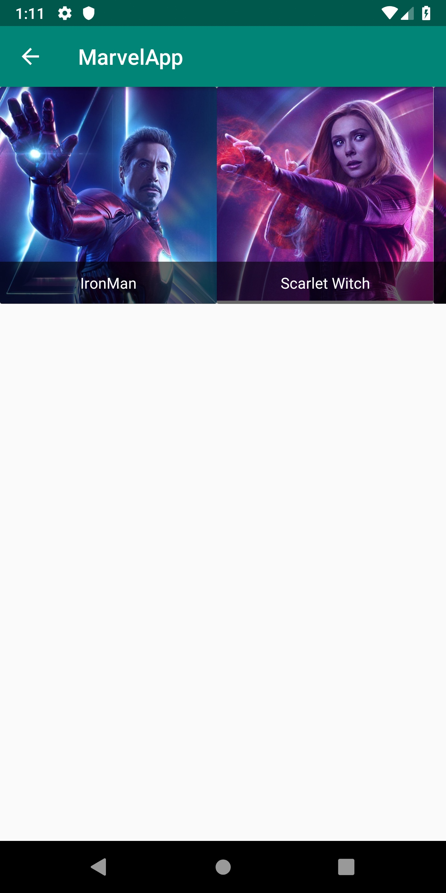

# kotlin-first
Codelab Kotlin - GDG Lima IO Extended Lima 2019

Slide : https://docs.google.com/presentation/d/1ASbryoETUm3Hgz4BERL45gzpOAdl_YdwVn0PIRgyV8E/edit?usp=sharing

Sample: https://github.com/emedinaa/kotlin-first/archive/master.zip

## Requerimientos 

- Android Studio 3.3.2 o superior https://developer.android.com/studio

- Conocimientos básicos de Android https://developer.android.com/ 

- Kotlin documentación oficial https://kotlinlang.org/docs/reference/

## Step 1 /2
En esta sección vamos crear un nuevo proyecto usando Android Studio con Kotlin y revisaremos los conceptos básicos del lenguaje Kotlin. Por ejemplo, tipos de Datos, funciones , null safety

## Step 3
En esta sección veremos sobre Collections, List, MutableLists y Adapters.

## Step 4
En esta sección veremos sobre Clases,Objetos,Herencia, Data Class y Extensiones

## Step 5 / 6
En esta sección veremos como conectar nuestra app a la nube usando retrofit, usos de funciones como parámetros.

# Screenshots
   
  

# References

Página oficial https://kotlinlang.org/

Documentación https://kotlinlang.org/docs/reference/

Compilador online https://play.kotlinlang.org/

Android Codelabs https://codelabs.developers.google.com/?cat=Android 

Github repositories https://github.com/search?q=language:Kotlin

Training :
- Kotlin for Android Developers https://es.coursera.org/learn/kotlin-for-java-developers
- Kotlin for Android Developers  https://www.udacity.com/course/kotlin-for-android-developers
- Kotlin Bootcamp for Programmers https://www.udacity.com/course/kotlin-bootcamp-for-programmers
- Developing Android App with Kotlin https://www.udacity.com/course/developing-android-apps-with-kotlin

Communities :
- Kotlin Perú
- Kotlin for Android Developers [antonioleiva.com]
